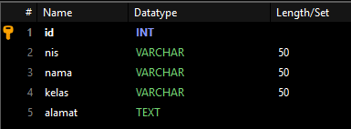
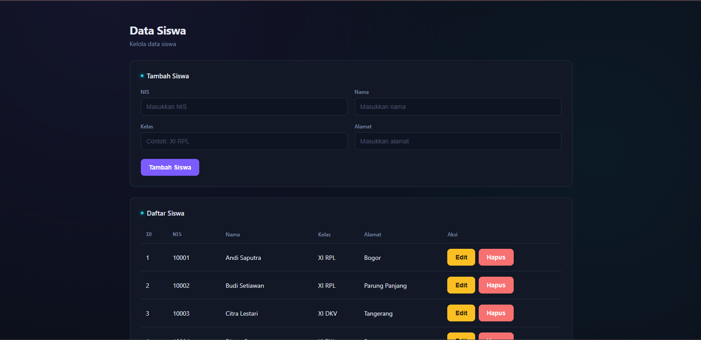
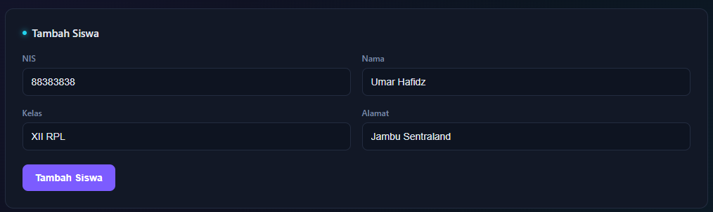
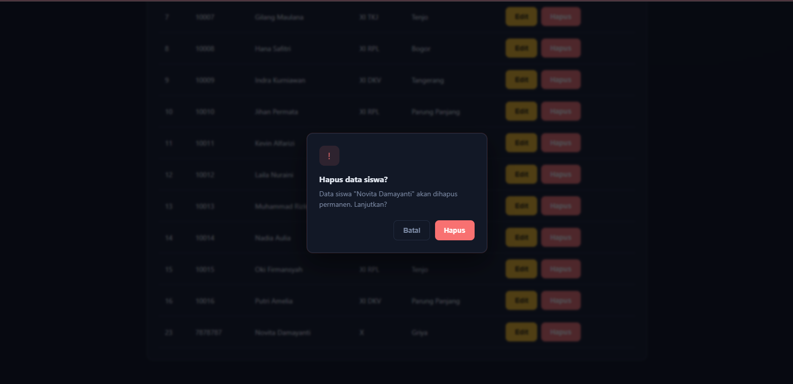
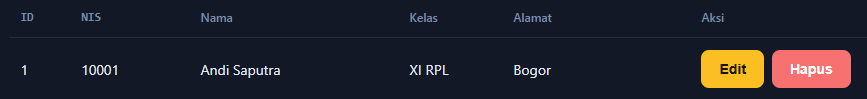
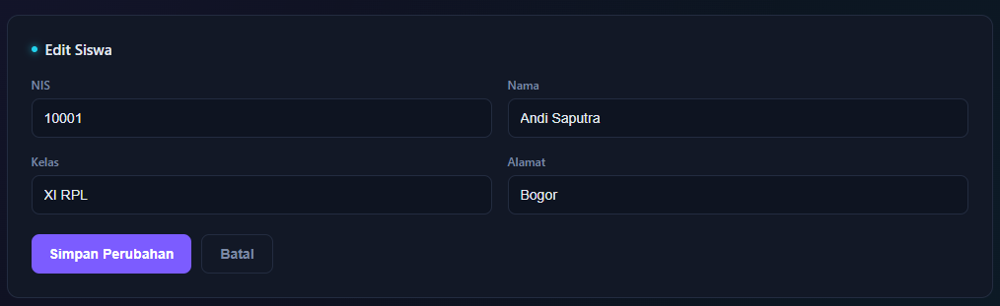
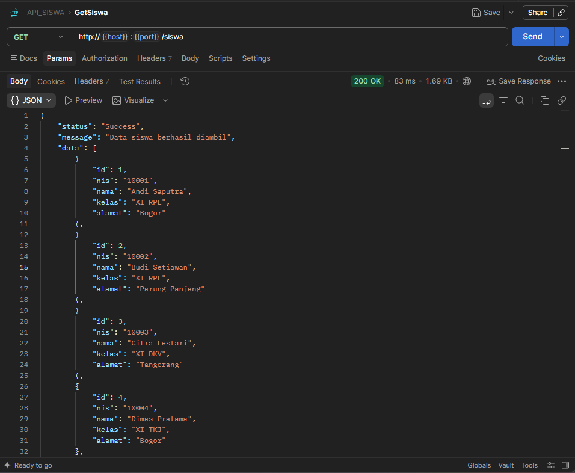
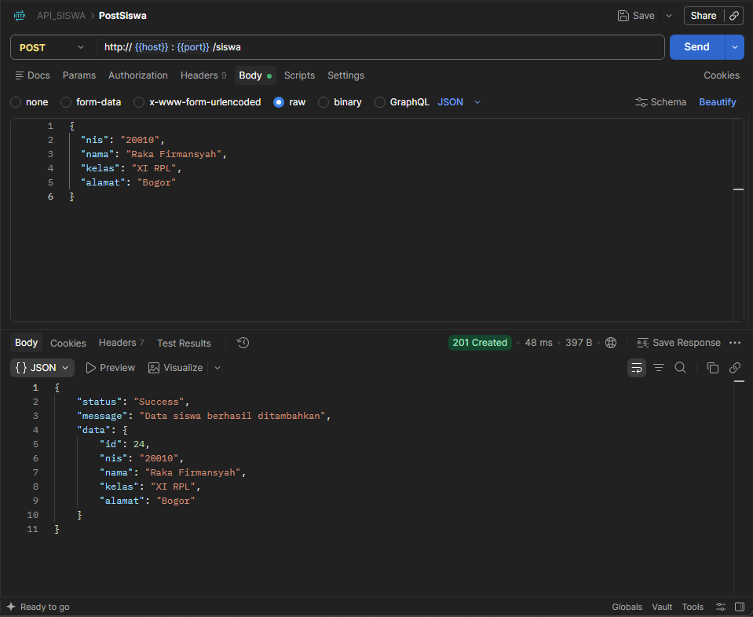
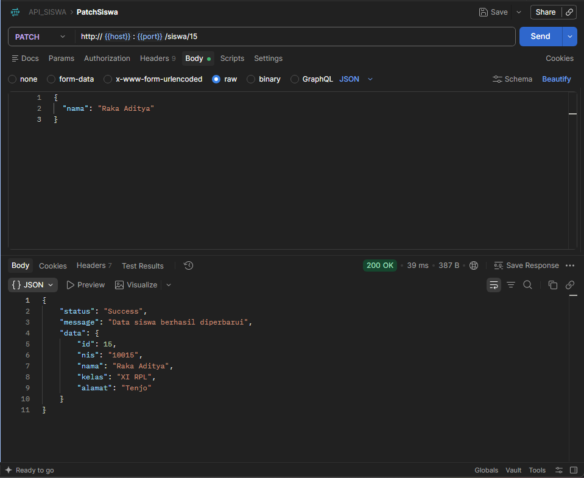
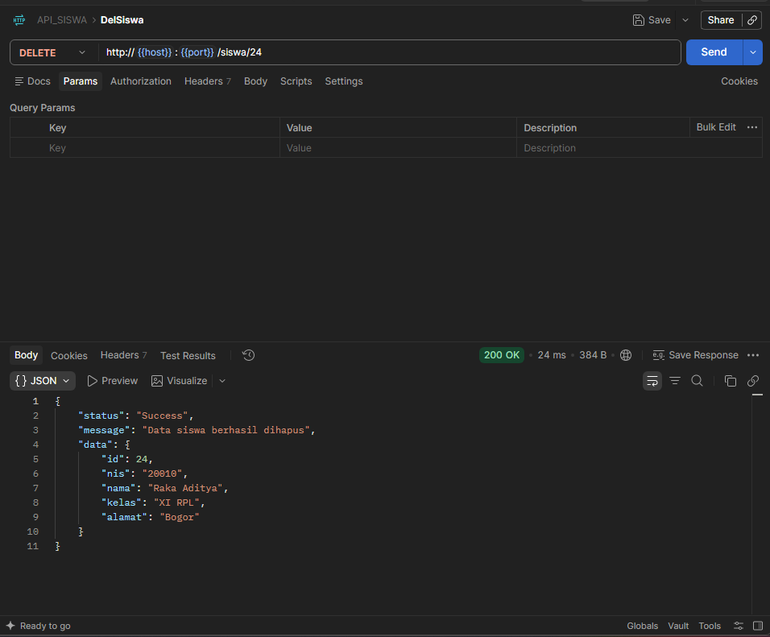

# Student Management REST API

## 1. Nama Aplikasi

**Student Management REST API**

Aplikasi sederhana untuk mengelola data siswa menggunakan REST API.

---

## 2. Deskripsi Aplikasi

Student Management REST API adalah aplikasi berbasis web yang digunakan untuk mengelola data siswa.

Aplikasi ini memiliki fitur:

- Menampilkan daftar siswa
- Menambahkan data siswa
- Mengubah data siswa
- Menghapus data siswa
- Menampilkan response dari API
- Loading saat mengambil data
- Pesan sukses dan error
- Konfirmasi sebelum menghapus data

---

## 3. Teknologi yang Digunakan

### Backend

- Node.js
- Express.js
- MySQL
- MySQL2
- dotenv

### Frontend

- HTML
- CSS
- JavaScript
- Fetch API

### Tools

- Visual Studio Code
- Postman
- Git
- GitHub
- XAMPP / MySQL

---

## 4. Cara Menjalankan Project

#### 1. Clone repository

```bash
git clone https://github.com/wann-a08/student-management-rest-api.git
```

#### 2. Masuk ke folder project

```bash
cd student-management-rest-api
```

#### 3. Install depedency

```bash
npm install
```

#### 4. Buat database MySQL



#### 5. Buat file .env

```bash
PORT=3000

DB_HOST=localhost
DB_USER=root
DB_PASSWORD=
DB_NAME=nama_database
DB_PORT=3306
```

sesuaikan DB_Name dengan nama database yang kamu gunakan

###### 1. Jalankan Backend

```bash
npm start
```

Bakend akan berjalan pada

```bash
http://localhost:3000
```

###### 2. Cara menjalankan Frontend

Frontend sudah terintegrasi dengan Express melalui folder `public`.

Setelah backend berhasil dijalankan, buka browser dan akses:

```bash
http://localhost:3000
```

Halaman tersebut akan menampilkan aplikasi Student Management.

Frontend akan berkomunikasi dengan backend melalui endpoint REST API yang tersedia.

### 6. Daftar Endpoint API

Base URL:

```bash
http://localhost:3000
```

##### GET - Mengambil Data Siswa

```bash
GET /siswa
```

Digunakan untuk mengambil seluruh data siswa dari database.

Contoh:

```bash
GET http://localhost:3000/siswa
```

##### POST - Menambahkan Data Siswa

```bash
POST /siswa
```

Digunakan untuk menambah data siswa baru.

Contoh request:

```bash
{
    "nis": "10021",
    "nama": "Iwan",
    "kelas": "XI RPL",
    "alamat": "Bogor"
}
```

##### PATCH - Mengubah Sebagian Data Siswa

```bash
PATCH /siswa:id
```

request:

```bash
{
    "nama": "Iwan Update"
}
```

##### DELETE  - Menghapus Data Siswa


```bash
DELETE /siswa/:id
```

Digunakan untuk mengahapus data siswa berdasarkan ID.

Contoh:

```bash
DELETE http://localhost:3000/siswa/1
```

Response:

```bash
{
    "status": "Success",
    "message": "Data siswa berhasil dihapus",
    "data": {
        "id": 1,
        "nis": "10001",
        "nama": "Andi Saputra",
        "kelas": "XI RPL",
        "alamat": "Bogor"
    }
}
```

### 7. Screenshot Aplikasi

##### Halaman Utama



##### Form Tambah Siswa



##### Button Konfirmasi Hapus Siswa



##### Form Edit Siswa





### Identitas Developer

Nama	:	Muhammad Ihwan Utomo

Kelas	:	XII

Jurusan	:	RPL (Rekayasa Perangkat Lunak)

Sekolah	:	SMK Bina Putra Mandiri

Tahun	:	2026/2027

#### PENGETESAN API

##### GET



##### POST



##### PATCH



##### DELETE


